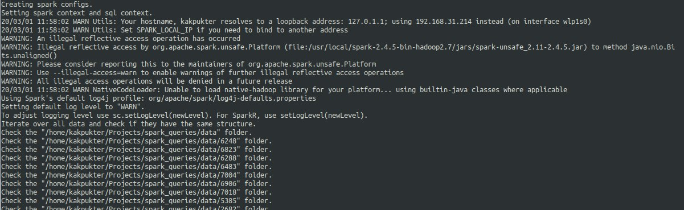
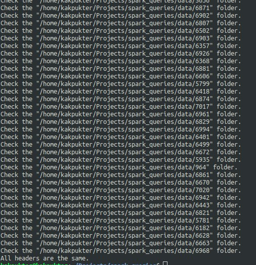
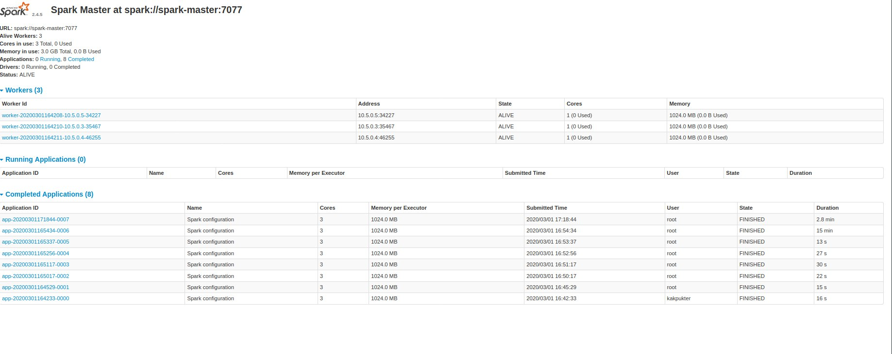
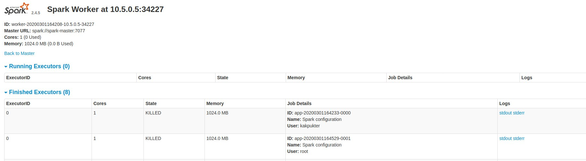
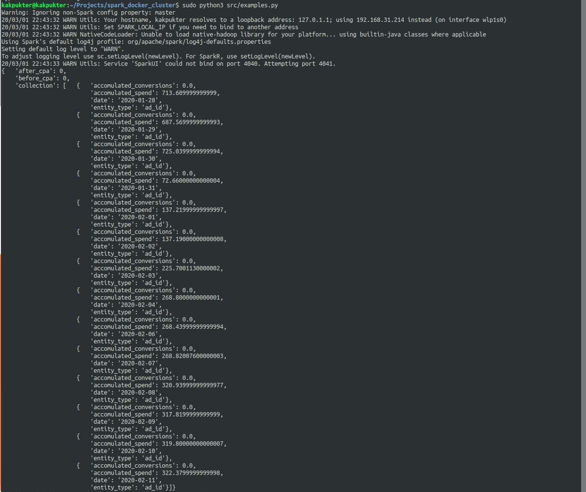

# Spark dokcer cluster with pyspark examples


Here is example of multi-worker spark cluster for big data cumputations.

  - Created docker-compose project to set spark in cloud
  - Created scripts to load data into spark
  - Written some examples of loaded data

Requirenment
  - Docker 
  - Docker compose
  - Linux based system

# Instructions!
 Firstly we need to clone the project
 ```
 $ git clone https://github.com/alexanderbakhmach/saprk_cluster_docker.git
 ```
 
 Then navigate to folder
 
 ```
 $ cd saprk_cluster_docker
 ```
 
 Prebuild images
 ```
 $ chmod 777 build-images.sh
 $ ./build-images.sh
 ```
 
 Then run the composer as the deamon
 ```
 $ docker-compose up -d
 ```
  Now we need to extract and download our *.csv data folder into the ./scr forder
  As the result we need to have the next structure
  - saprk_cluster_docke
       - src
            - data
                - 1234
                    - some_data1.csv   
                    - some_data2.csv

The next way we need to create the symb link to that folder
```
$  ln -s $ABS_PATH_OF_FOLDER/saprk_cluster_docker/src/data /data
```
We need that because the spark here is not powered by hdfs such as hadoop
And if we will have no such symb link, the workers would not found the files by path

Next we are ready to execute our scripts.
Firstly lest make some research and figure out if our .csv files are structured the same way.
```
$ python3 src/check_samely.py
```
We have no logs telling us that structure was not the same
That mean that we can load all data in one thread
Let`s do it
```
$ python3 src/compressor.py
```
 Here we load our data as parquet
 It is better to store data such way because it reduce the data size and makes requests faster
 Because of we are working with csv file with is similar in structure with relation database tables
 it is obvious to use SQL query labguage to work with this data.
 
Next we ready to test queries
```
$ python3 src/examples.py
```





